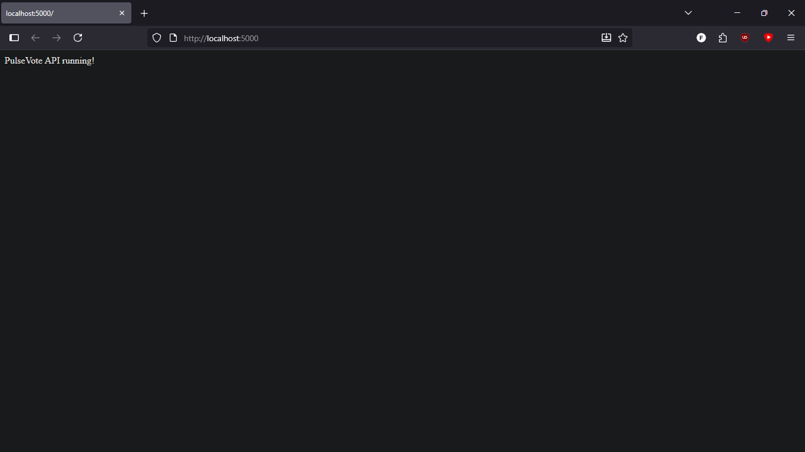
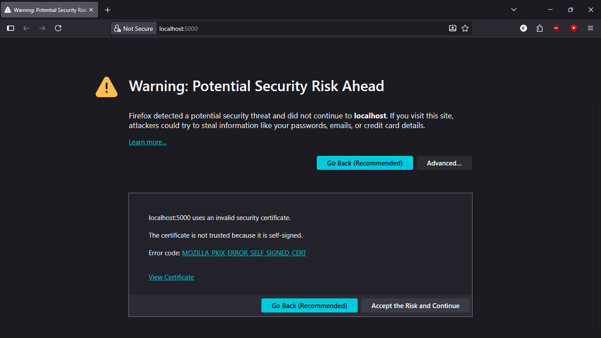
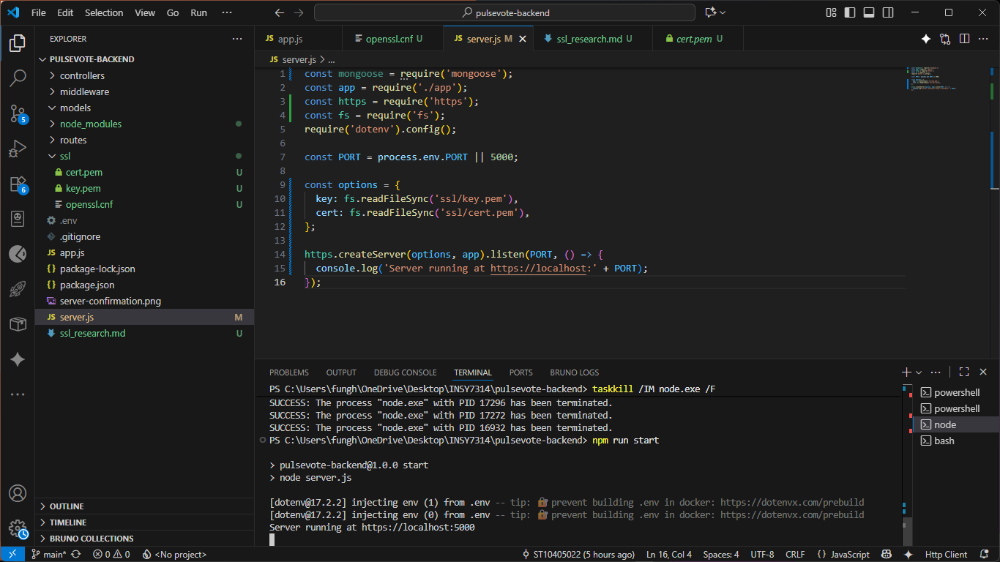
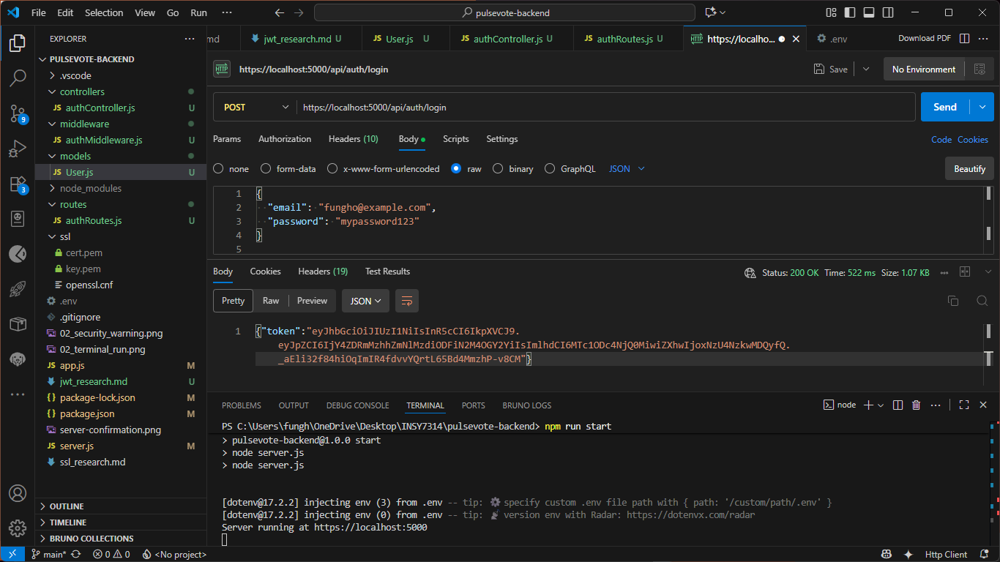
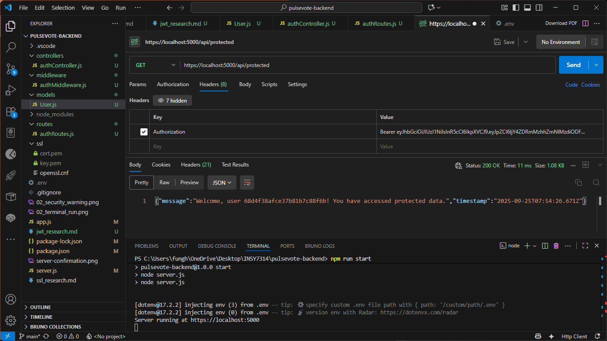
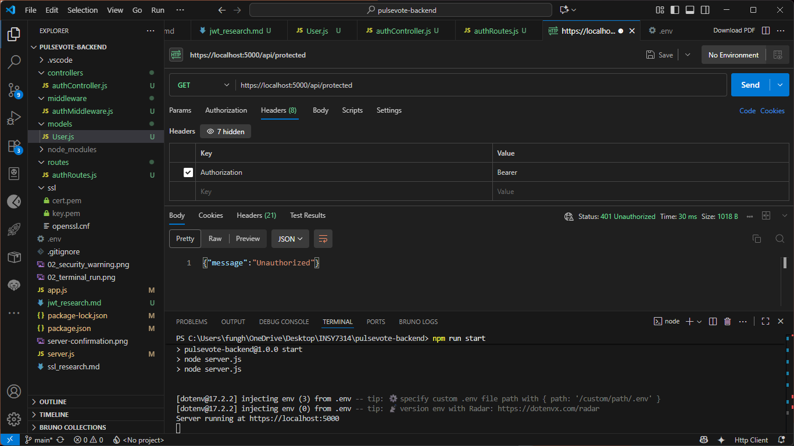
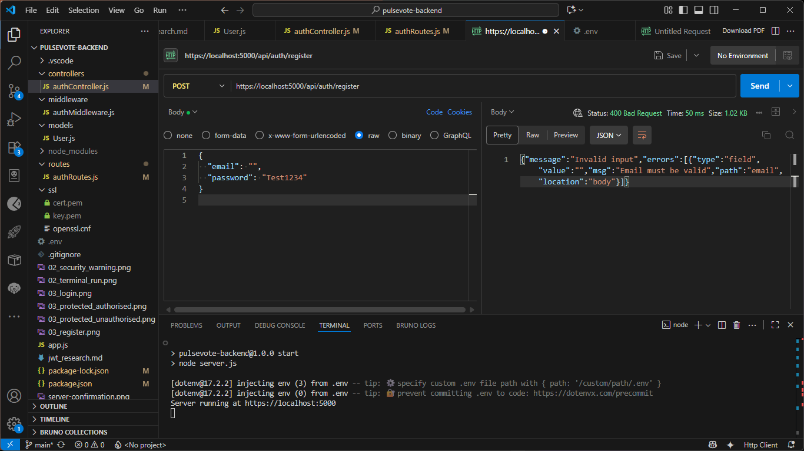
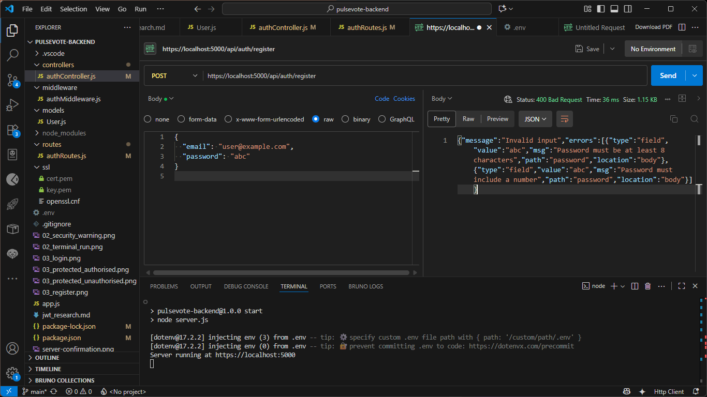
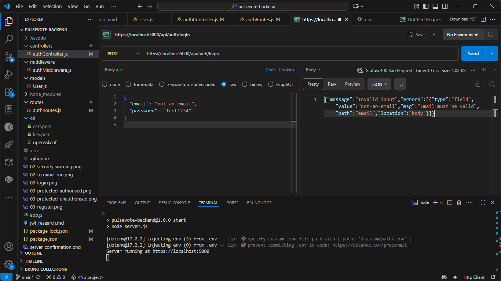
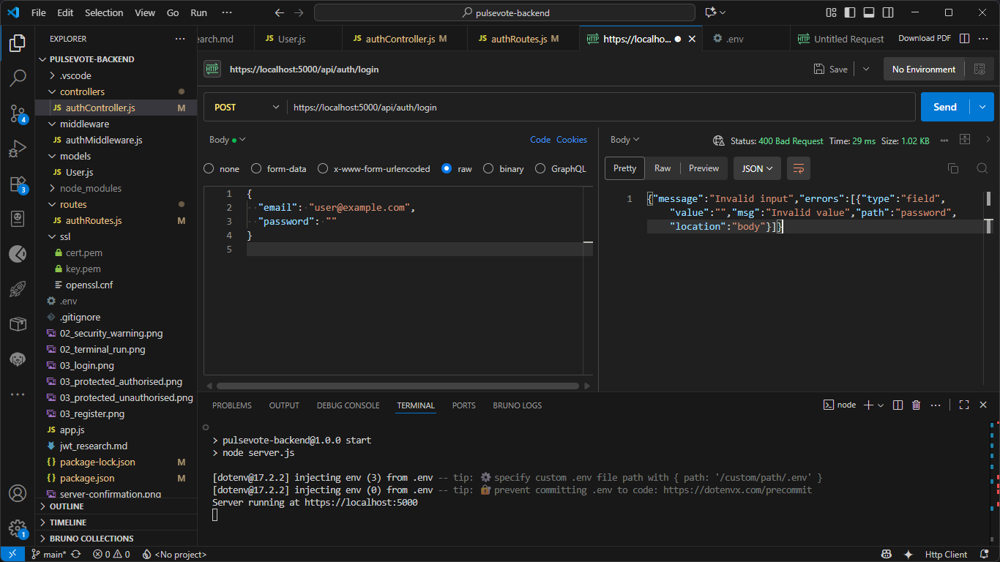

# PulseVote Backend

---

## 01 – Setting up Foundations
✅ Evidence: Server running successfully in terminal.  

---

## 02 - Adding SSL
✅ Evidence: HTTPS server running successfully.  

---

## 03 - Adding Authentication with JWT
✅ Evidence: Successful register, login and protected responses in Postman.
- **Register a new user**  

- **Login with valid credentials**  

- **Access protected route (Authorized)**  

- **Access protected route (Unauthorized)**  

---

## 05 - Securing your login
✅ Evidence:  
- **Invalid email rejected**  
  
- **Weak password rejected**  
  
- **Invalid login email**  
  
- **Invalid login password**  

